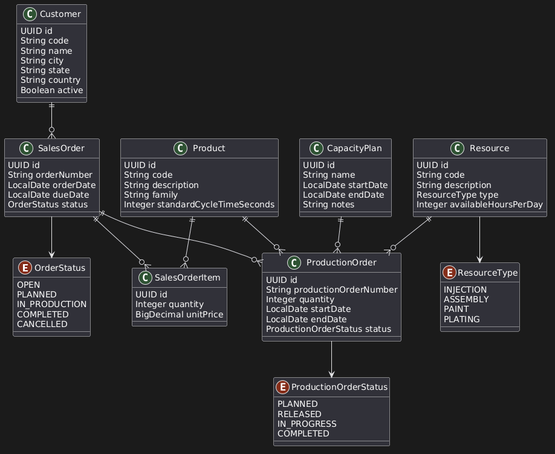

# 🏭 Smart Production Planner

> **Sistema Corporativo de Simulação de Capacidade Crítica e Planejamento de Produção (PCP).**

[](https://github.com/rapassos)
[](https://openjdk.org/)
[](https://spring.io/projects/spring-boot)
[](https://www.postgresql.org/)

---

## 🎯 Visão Geral & Valor de Negócio

O **Smart Production Planner** é uma solução de suporte à decisão para o Planejamento e Controle da Produção (PCP). O projeto nasceu da necessidade real observada em ambientes industriais de alta complexidade (Automotivo e Metalúrgico) de substituir o sequenciamento manual e descentralizado por uma lógica de dados integrada.

O sistema foca em responder questões críticas para a eficiência operacional:
* **Gargalos:** Quais recursos produtivos estão sobrecarregados no horizonte atual?
* **Riscos:** Quais pedidos correm risco de atraso por falta de capacidade ou materiais?
* **Simulação:** Qual o impacto de um novo pedido na ocupação dos recursos existentes?

---

## 🏛️ Estilo Arquitetural: Monolito Modular

Para garantir a **velocidade de desenvolvimento de um MVP** sem comprometer a **escalabilidade futura**, adotei o padrão de **Monolito Modular**. 

Esta abordagem permite que a aplicação seja implantada de forma única, mas mantenha fronteiras claras entre domínios (Bounded Contexts), facilitando uma eventual transição para Microserviços se o volume de transações assim exigir.

### Domínios Estruturados:
* **Planning:** Gestão de Ordens de Produção e Sequenciamento.
* **Resources:** Capacidade, Turnos e Centros de Trabalho.
* **Sales:** Gestão de Pedidos e Clientes.
* **Indicators:** Inteligência Operacional e Preditiva.

---

## 🚧 Roadmap & Governança Técnica

O projeto segue um ciclo de desenvolvimento estruturado por Sprints, com foco inicial em **Foundation & Domain Modeling**.

### Sprint 0 — Concluída ✅
* [x] **Modelagem de Domínio:** Definição das entidades e relacionamentos industriais.
* [x] **ADR-001 — Monólito Modular:** Decisão documentada sobre a arquitetura do sistema.
* [x] **ADR-002 — Persistência:** Definição do PostgreSQL como base de dados relacional.
* [x] **Design de Dados:** Elaboração do Modelo Lógico.

### Sprint Foundation — Em Progresso 🏗️
* [ ] Setup do ecossistema Spring Boot 3 + Java 21.
* [ ] Containerização do ambiente de desenvolvimento (Docker Compose).
* [ ] Implementação do versionamento de base de dados com Flyway.

---

## 📊 Modelo de Domínio

A inteligência do sistema reside na correta modelagem das restrições industriais. O diagrama abaixo detalha como os Recursos, Pedidos e Ordens de Produção se conectam:



---

## 🛠️ Stack Tecnológica

* **Backend:** Java 21, Spring Boot 3, Spring Data JPA, Bean Validation.
* **Banco de Dados:** PostgreSQL 17.
* **Testes:** JUnit 5, Mockito.
* **Infraestrutura:** Docker, Docker Compose, Flyway.
* **Frontend (Futuro):** React + TypeScript.

---

## 📚 Documentação e Decisões Técnicas

Um diferencial deste projeto é a utilização de **ADRs (Architectural Decision Records)**. Entendo que o "porquê" de uma decisão técnica é tão importante quanto o código em si.

```text
docs
├── adr
│   ├── ADR-001-monolito-modular.md  # Justificativa da arquitetura modular
│   └── ADR-002-postgresql.md        # Critérios para escolha do RDBMS
├── architecture
│   └── system-overview.md           # Visão de alto nível
└── diagrams
    └── domain-model.puml            # Código-fonte do diagrama (PlantUML)
```

## 🚀 Evoluções Planejadas

* MRP Simplificado: Cálculo de necessidade de materiais integrado ao plano.
* Integração SAP PP/Datasul: Módulos de interface para ERPs de mercado.
* IA de Planejamento: Sugestão automática de sequenciamento para otimização de setup.

## Autor

*Rafael Passos*

Engenheiro de Software Backend | Especialista em Operações Industriais

[](https://linkedin.com/in/rapassos)
[](mailto:rapassos@gmail.com)

Este é um projeto de portfólio focado em demonstrar competências em Arquitetura de Software, Java Enterprise e conhecimento de domínio industrial.
